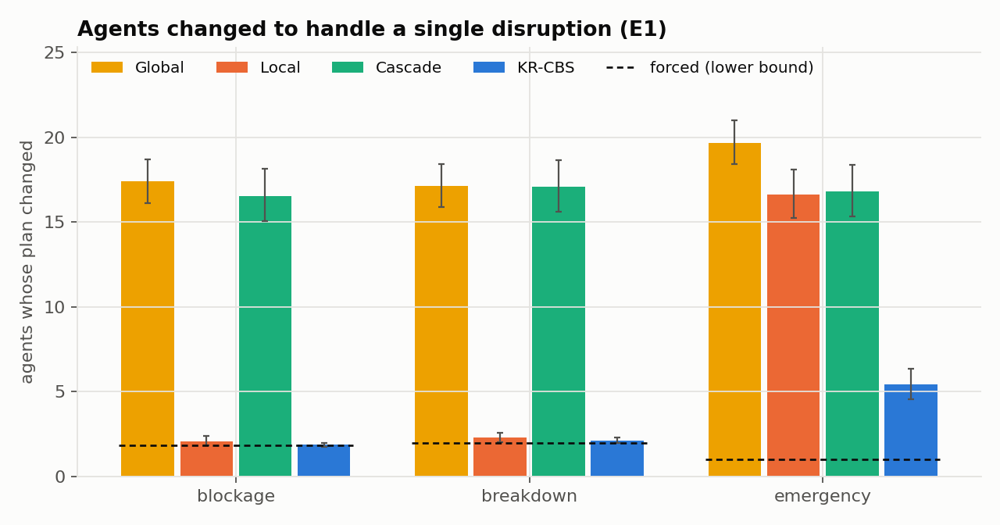
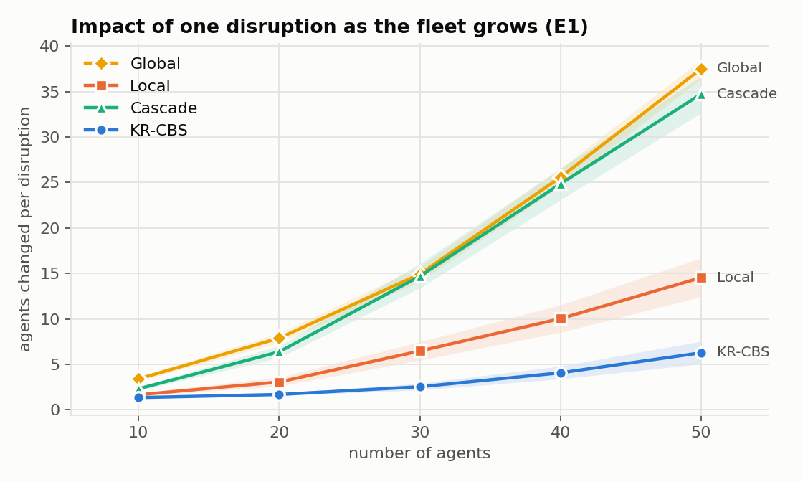
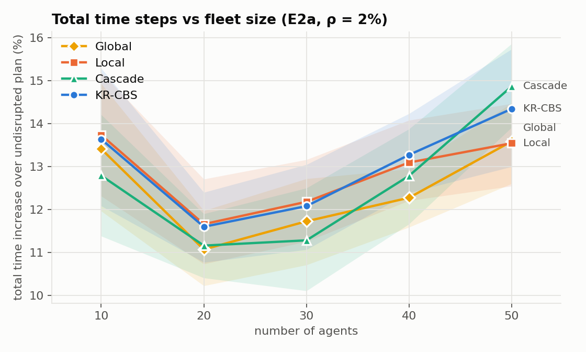
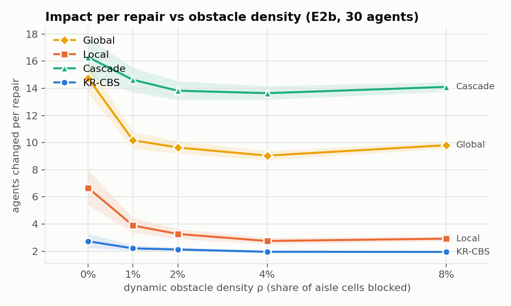
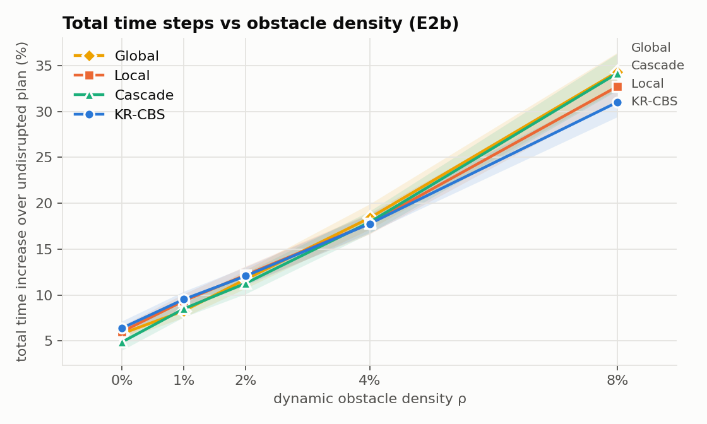
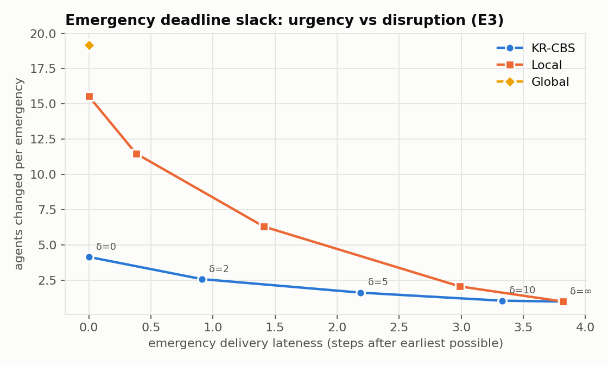
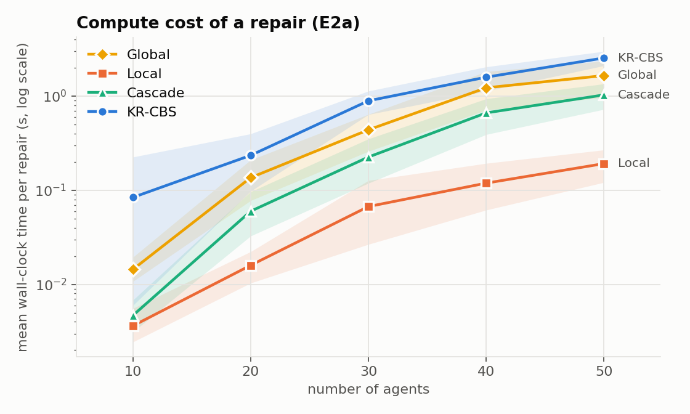
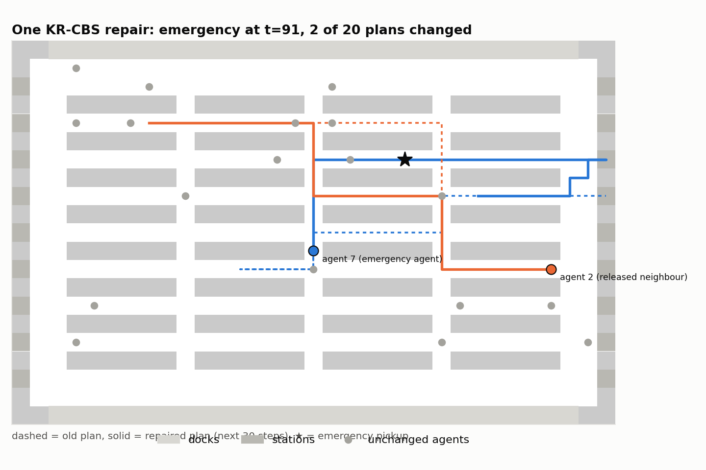

# Multiagent Plan Repair in an Automated Warehouse

*Autonomous Systems assignment -- minimum-change plan repair by negotiation*

---

## 1. Problem and assumptions

Robots work on a warehouse floor laid out as a 2D grid. Each robot starts at its
own dock and must pick up a set of assigned objects and carry each to a delivery
station. Paths come from a multi-agent path-finding (MAPF) planner. While the
robots execute them, three kinds of disruption occur: a **cell is suddenly
blocked**, a **robot breaks down**, or a robot is given a **high-priority
emergency task**.

The repair must:

1. be negotiated between the disrupted agents and their neighbours;
2. never re-run the plan generator from scratch;
3. **minimise the number of agents whose plans are altered**.

It is evaluated on **total time steps**, on **the number of agents changed per
disruption**, and on how both scale with **the number of agents** and **the
density of dynamic obstacles**.

**Model.**

- **Grid.** 4-connected. Each step an agent moves to a neighbouring cell or
  waits; both cost one time step.
- **Conflicts.** Two agents may not occupy the same cell at the same time
  (*vertex* conflict) or swap cells in one step (*swap* conflict). Following
  directly behind another agent is allowed: repairs are computed before agents
  move, so a breakdown can never cause a rear-end collision.
- **Layout.** A Kiva-style warehouse, 21 × 33 for the main experiments. It has
  rows of shelves with 1-wide aisles and cross-aisles, and a corridor ringing
  the shelf area. Pickup points are aisle cells next to a shelf.
- **Docks and stations.** Docks are dead-end cells on the top and bottom
  edges, one private dock per robot: no other robot may enter it. Delivery
  stations are dead-end cells on the left and right edges, shared by all.
  Robots park only in docks, so a parked robot never blocks anyone. Ma et al.
  (2017) call such a layout *well-formed*.
- **Mission.** Each robot follows dock → p₁ → d₁ → … → pₘ → dₘ → dock, with m = 3
  objects carried one at a time. Each robot orders its own tasks optimally by
  trying all m! orders on static distances.
- **Completion and metrics.** An agent's completion time Cᵢ is when it is back
  at its dock with every delivery made. **Total time = SOC = Σ Cᵢ** (sum of
  costs); the makespan, max Cᵢ, is also reported.
- **Knowledge.** Committed plans are posted on a shared space-time
  *reservation board* that any agent can read, as in a warehouse
  traffic-management system. A disruption is announced when it happens,
  together with its duration. Nobody knows about future disruptions. Asking
  another agent to change its plan takes messages.

## 2. Initial planning: prioritized multi-goal Space-Time A*

**Low-level search.** One multi-goal Space-Time A* does every search in the
system.

- **State:** (cell, time, index of next goal).
- **Heuristic:** the exact static distance through all remaining goals, from
  cached BFS maps.
- **Hard constraints:** walls, other agents' docks, blocked-cell windows,
  frozen (broken-down) agents, CBS constraints, an optional deadline on one
  goal, and the reservation-board entries of agents classed as *hard*.
- **Soft constraints:** entries of agents classed as *soft* may be crossed, but
  each crossing counts as a conflict.
- **Result:** the cheapest path and, among the cheapest, the one with fewest
  soft conflicts. This ordering is exact because every path to a state has the
  same cost, so the priority (f, soft) is consistent.
- **Termination:** after the last time any dynamic constraint exists the world
  is static, so the search finishes with the exact static route.
- **Budget:** searches are bounded by an expansion count, never by wall-clock
  time.

**Plan generation.** The plan generator is *prioritized planning* (Cooperative
A*): agents are planned one at a time, longest tour first, each treating
earlier plans as hard. A failed agent is moved to the front and planning
restarts. In this layout it always succeeds at t = 0.

## 3. Disruptions and how agents detect them

Each disruption's directly affected agents -- the **forced** agents, whose plans
it makes infeasible -- are found by each agent checking its own plan against
the new world.

| Disruption | Semantics | Forced agents |
|---|---|---|
| Blockage | Cell c is blocked for d ~ U[10,30] steps. Never placed on docks or stations, and never under a robot: the start is deferred until c is free. | Agents whose plan uses c during the window |
| Breakdown | Robot b freezes for d ~ U[5,20] steps, then continues. While frozen, b is an obstacle, not a negotiator. | b, plus agents whose plan enters b's cell during the window |
| Emergency | Robot e gets an urgent pickup → delivery placed first in its goal list, with deadline = earliest possible delivery + δ (δ = 0 by default) | e |

**Obstacle density ρ** is the average fraction of blockable cells blocked at
any moment: arrival rate × mean duration ÷ number of cells. Breakdowns
average 0.3 per robot per episode, and there are 2 emergencies per episode.

Each event type has its own random stream, so every strategy sees exactly the
same disruptions.

## 4. Repair: Keep/Release Conflict-Based Search (KR-CBS)

### 4.1 Objective

For each disruption, minimise in strict priority order:

1. the number of agents whose plan (from now on) differs from their committed
   plan;
2. total time (SOC).

The lower bound for (1) is the number of forced agents.

### 4.2 The search

A search node holds:

- **R:** agents released to replan (initially the forced agents);
- **K:** agents kept, whose committed plans are *hard* for everyone in R;
- the CBS constraints;
- a path for each agent in R.

Every other agent is *undecided*: its committed plan is a *soft* obstacle, so
low-level searches may cross it but prefer not to. Expanding a node takes its
earliest conflict:

- **Between two agents in R:** the ordinary CBS split (constrain one or the
  other).
- **Between i ∈ R and an undecided agent j:**
  - **KEEP j:** j joins K, and agents of R that collided with j replan around
    it.
  - **RELEASE j:** j joins R and receives a REPLAN_REQUEST. It plans its own
    new route and answers with a PROPOSAL.

Nodes are expanded best-first by the key (|R|, SOC, soft conflicts).

**Why the answer is the minimum.** Every possible repair either leaves j's plan
untouched -- it lies under KEEP j -- or changes it -- it lies under RELEASE j. So
the two children together contain every repair. Within one value of |R|,
adding constraints or kept agents can only raise SOC. Nodes are therefore
popped level by level, and the first conflict-free node has the fewest
released agents and, among those, the least total time.

A released agent that ends up with its old plan would mean the same repair
exists one level lower, where it would already have been found. So "released"
equals "changed" at the optimum. The result is optimal *per repair*; it cannot
anticipate future disruptions.

**Engineering details.**

- *Fast path:* first try "only the forced agents replan, everyone else
  fixed". This is plain CBS over the forced agents, it is the commonest case,
  and it is exact for that level.
- *Conflict-avoidance table:* each low-level search counts collisions with the
  other released agents' current paths as soft conflicts. This steers ties
  away from needless internal conflicts without changing any cost.
- *Budgets:* 1,500 high-level nodes per stage. If the exact stage runs out, a
  **greedy** stage orders nodes by |R| + (number of distinct undecided agents
  still hit). Its answers are flagged as not exact.
- *Infeasible deadline:* if an emergency deadline has become impossible -- for
  example because the robot carrying it broke down -- KR-CBS repairs again
  with the deadline relaxed, and records that it did.

### 4.3 Negotiation protocol

The forced agent whose plan breaks soonest leads the session. Messages are:

- **REPLAN_REQUEST** (leader → j): constraints, plus the set of kept agents;
- **PROPOSAL / CANNOT_COMPLY** (j → leader);
- **COMMIT** (to every agent whose plan changes) and **RELEASE** (to agents
  consulted but left unchanged).

An agent plans only its own route, so its task list stays private. The
"neighbours" an agent negotiates with are exactly the agents whose committed
trajectories conflict with a proposed path. The group grows only through such
conflicts. Every strategy's searches go through the same session object, so
message counts are comparable.

### 4.4 Escalation -- never inventing a plan

If KR-CBS cannot repair within budget, the escalation chain is:

1. prioritized replanning of every agent within radius 4, then 8, then 16 of
   the disruption;
2. a global replan;
3. the same with deadlines relaxed;
4. if the fleet is gridlocked, a **global pause**: every active agent stands
   still for d steps (d = 2, 4, …, 64) and the fleet is replanned from there.
   Standing still is always physically safe, and obstacle windows expire
   during the pause.

Every escalation is recorded. A repair that still fails ends the episode as a
failure; it is never covered with a fabricated plan. After every commit an
independent checker, sharing no code with the planner, replays all plans
looking for collisions, illegal moves, entries into blocked cells or others'
docks, and missed goals.

## 5. Strategies compared

All strategies are compared on identical instances, initial plans and
disruptions.

| Strategy | Who replans | Role |
|---|---|---|
| **Global** | everyone, prioritized planning from the current state | the reference the assignment forbids |
| **Local** | forced agents only, one after another, everyone else fixed; on failure, global | repair with no negotiation |
| **Cascade** | forced agents take priority; anyone they collide with replans around them, recursively | naive "get out of my way" negotiation |
| **KR-CBS** | the smallest possible set of agents, found exactly | proposed |

## 6. Experiments

| | What varies | Answers |
|---|---|---|
| **E1** | One disruption is injected into a running plan, chosen so it is sure to hit someone. Fleet size N ∈ {10, 20, 30, 40, 50} × the 3 types × 100 samples. Every strategy repairs the *identical* state. | Agents changed per single disruption |
| **E2a** | Full episodes, N ∈ {10, …, 50}, ρ = 2%, 20 seeds | Total time; scaling with N |
| **E2b** | Full episodes, ρ ∈ {0, 1, 2, 4, 8}%, N = 30, 20 seeds | Total time; scaling with density |
| **E3** | Emergency slack δ ∈ {0, 2, 5, 10, ∞}, N = 30, 100 samples | Agents changed vs emergency lateness |
| **E4** | KR-CBS against a brute-force oracle on the small map, N ∈ {4, 6, 8}. The oracle tries every coalition, smallest first, and solves each optimally. | Is KR-CBS really minimal? |

Means are reported with 95% bootstrap confidence intervals.

Every episode in E2a and E2b -- 800 episodes, 4 strategies -- completed every
task, and the independent checker found no violation in any repair. Full
tables are in [results/summary.md](../results/summary.md).

## 7. Results

### 7.1 Agents changed to handle a single disruption (E1)

There were 1,429 disruptions, each repaired by all four strategies from the
identical state. "Forced" is the lower bound: these agents' plans were broken
by the disruption itself.

| Disruption | Forced | **KR-CBS** | Local | Cascade | Global |
|---|---|---|---|---|---|
| Blockage | 1.86 | **1.87** [1.77, 1.98] | 2.07 | 16.54 | 17.38 |
| Breakdown | 1.99 | **2.13** [1.98, 2.30] | 2.29 | 17.08 | 17.14 |
| Emergency (δ = 0) | 1.00 | **5.44** [4.58, 6.35] | 16.63 | 16.79 | 19.65 |
| All | 1.60 | **3.21** [2.92, 3.55] | 7.24 | 16.82 | 18.09 |

- **Blockages and breakdowns.** KR-CBS is essentially at the floor: an
  average of 0.02 extra agents for a blockage. Local repair matches it when
  the forced agents can simply route around everyone else. When they cannot,
  Local has no way to negotiate and falls back to a global replan.
- **Emergencies are the real test.** A zero-slack emergency must take its
  fastest route, so other agents *must* make way. KR-CBS finds the few that
  have to move: 5.4 agents changed, versus 16–20 for every alternative.
- **Exactness.** KR-CBS proved its answer minimal in 99.5% of blockages, 97.2%
  of breakdowns and 74.2% of emergencies. The rest came from the greedy stage
  or the escalation chain and are flagged.

As the fleet grows from 10 to 50 robots, KR-CBS changes 1.34 → 6.27 agents
per disruption (forced: 1.19 → 2.00). Global changes 3.4 → 37.5, Cascade
2.3 → 34.7, and Local 1.7 → 14.5. Global and Cascade grow with the fleet
itself. KR-CBS grows only with the local congestion around the disruption.

**What the minimum costs in time.** The mean increase in total time per
disruption was 29.3 steps for KR-CBS, 29.2 for Local and 26.7 for Global.
Cascade had 15.7, because it gives the disrupted agent right of way and makes
everyone else absorb the delay -- changing 17 agents to do it.

### 7.2 Total time steps and scaling with the number of agents (E2a)

Full episodes at ρ = 2%; mean of 20 seeds, 95% CI.

| Agents | Undisrupted SOC | KR-CBS SOC | Local | Cascade | Global | Changed/repair: **KR-CBS** / Local / Cascade / Global (forced) |
|---|---|---|---|---|---|---|
| 10 | 1,393 | 1,582 | 1,584 | 1,570 | 1,579 | **1.28** / 1.47 / 2.16 / 2.58 (1.23) |
| 20 | 2,824 | 3,151 | 3,153 | 3,138 | 3,136 | **1.61** / 2.45 / 6.80 / 5.42 (1.52) |
| 30 | 4,241 | 4,752 | 4,757 | 4,718 | 4,737 | **2.13** / 3.27 / 13.82 / 9.64 (1.84) |
| 40 | 5,827 | 6,599 | 6,589 | 6,571 | 6,541 | **2.51** / 4.09 / 23.29 / 16.01 (2.10) |
| 50 | 7,457 | 8,526 | 8,465 | 8,566 | 8,469 | **3.40** / 5.50 / 31.83 / 24.11 (2.44) |

- **Total time is statistically the same for all four strategies** at every
  fleet size; the confidence intervals overlap, as plotted. Disruptions add
  about 12–14% to the undisrupted total, and the choice of repair strategy
  hardly changes that.
- **What does differ is how much of the fleet is disturbed.** At 50 agents a
  repair by Global rewrites 24 plans and one by Cascade 32. KR-CBS rewrites
  3.4, against an unavoidable 2.44.
- **Robustness.** Over the episodes, KR-CBS fell back to escalation in 0.2–5%
  of repairs. Local fell back in 5–7% (each time to a global replan), and
  Cascade in up to 43%.

### 7.3 Scaling with the density of dynamic obstacles (E2b)

30 agents; ρ is the share of blockable cells blocked at an average moment.
The realised averages were up to 6.5%.

| ρ | Repairs/episode | KR-CBS SOC | Local | Cascade | Global | Changed/repair: **KR-CBS** / Local / Cascade / Global (forced) |
|---|---|---|---|---|---|---|
| 0% | 10 | 4,512 | 4,495 | 4,448 | 4,486 | **2.73** / 6.66 / 16.29 / 14.74 (1.76) |
| 1% | 29 | 4,645 | 4,638 | 4,601 | 4,591 | **2.21** / 3.89 / 14.62 / 10.18 (1.84) |
| 2% | 49 | 4,752 | 4,757 | 4,718 | 4,737 | **2.13** / 3.27 / 13.82 / 9.64 (1.84) |
| 4% | 90 | 4,994 | 4,994 | 5,001 | 5,019 | **1.96** / 2.76 / 13.64 / 9.04 (1.82) |
| 8% | 174 | **5,556** | 5,628 | 5,690 | 5,697 | **1.95** / 2.93 / 14.10 / 9.81 (1.84) |

- **Density mainly multiplies the *number* of repairs**, from 10 to 174 per
  episode. Total time rises from +6% to +31–34% over the undisrupted plan.
- **The cost of each repair stays flat for KR-CBS.** About 2 agents per
  repair, against an unavoidable ~1.8, at every density.
- **At ρ = 0 only breakdowns and emergencies happen.** That is why
  changed/repair is highest there for every strategy: emergencies dominate.
- **At the highest density KR-CBS has the lowest total time**: 5,556 against
  5,697 for Global. When repairs are frequent, rewriting many plans each time
  keeps creating new conflicts with the next disruption. Leaving undisturbed
  plans alone is better for throughput, not just for stability.

### 7.4 Emergency deadline slack (E3)

| Slack δ | KR-CBS: changed / lateness | Local: changed / lateness | Global: changed |
|---|---|---|---|
| 0 | 4.16 / 0.0 | 15.54 / 0.0 | 19.16 |
| 2 | 2.59 / 0.9 | 11.49 / 0.4 | 19.16 |
| 5 | 1.63 / 2.2 | 6.31 / 1.4 | 19.16 |
| 10 | 1.06 / 3.3 | 2.07 / 3.0 | 19.16 |
| ∞ | 1.00 / 3.8 | 1.00 / 3.8 | 19.16 |

The deadline turns "how urgent is it?" into an explicit dial. Letting an
emergency arrive 2 steps later than physically possible cuts the disturbance
from 4.2 to 2.6 agents; 10 steps of slack disturbs no one else. At every δ,
KR-CBS meets the deadline while disturbing the fewest agents.

### 7.5 Is KR-CBS really minimal? (E4)

On the small map, 201 disruptions were checked against the brute-force oracle.

| Agents | Disruptions | Proven exact | Changed = true minimum | SOC = true minimum |
|---|---|---|---|---|
| 4 | 68 | 68 | 68/68 | 68/68 |
| 6 | 66 | 66 | 66/66 | 66/66 |
| 8 | 67 | 64 | 64/64 | 64/64 |

Whenever KR-CBS finished within its budget, its repair was exactly minimal in
both the number of agents changed and total time. In the 3 cases where it ran
out of budget, the greedy stage overshot the minimum by 1.7 agents on average.

### 7.6 Cost

KR-CBS is the most expensive strategy to compute. At 50 agents a repair takes
about 2.6 s on average, against 1.7 s for Global and 0.2 s for Local. Most
repairs take the fast path ("only the forced agents change") and finish in a
fraction of a second. The cost is concentrated in emergencies, where the
search must prove that fewer releases are impossible.

The same holds for negotiation: an average of 829 messages per disruption,
1,972 for emergencies. Every request the leader sends while exploring an
option counts, including options it then rejects.

## 8. Discussion and limitations

- **Why a search over real paths, not a DCOP over candidate paths.** The
  textbook's plan-combination view casts coordination as each agent choosing
  among candidate plans -- a DCOP that ADOPT could solve. Doing that requires
  precomputing a few candidates per agent, and the candidates then cap the
  answer. An earlier attempt at this assignment found greedy, ADOPT and
  no-negotiation all tied, because all three chose from the same few
  candidates. KR-CBS keeps the plan-combination idea -- a search over which
  agents keep and which modify their plans (plan modification, Weiss Ch 11)
  -- but generates each candidate on demand with a full space-time search.
  That is what makes the minimum both reachable and checkable.
- **Optimal per repair, not per episode.** Future disruptions are unknown;
  E2b suggests that minimal change is also good for throughput when
  disruptions are frequent.
- **Assumptions.**
  - Execution is exact (no random delays).
  - Disruption durations are announced.
  - Plans are shared through a common reservation board; only *changing*
    another agent's plan needs negotiation.
  - Following another agent closely is allowed.
- **Budgets.** Exactness is guaranteed only within the node budget. 10% of E1
  repairs, mostly emergencies, used the greedy stage or escalation instead,
  and are reported as such rather than as optimal.
- **Gridlock.** In the densest settings prioritized replanning can gridlock.
  The global pause recovers, but every agent then counts as changed.

## References

- E. Durfee, S. Zilberstein. *Multiagent Planning, Control, and Execution.*
  In G. Weiss (ed.), *Multiagent Systems*, 2nd ed., MIT Press, 2013, ch. 11.
- G. Sharon, R. Stern, A. Felner, N. Sturtevant. Conflict-based search for
  optimal multi-agent pathfinding. *Artificial Intelligence* 219, 2015.
- D. Silver. Cooperative pathfinding. *AIIDE*, 2005.
- H. Ma, J. Li, T. K. S. Kumar, S. Koenig. Lifelong multi-agent path finding
  for online pickup and delivery tasks. *AAMAS*, 2017.
- M. Fox, A. Gerevini, D. Long, I. Serina. Plan stability: replanning versus
  plan repair. *ICAPS*, 2006.
